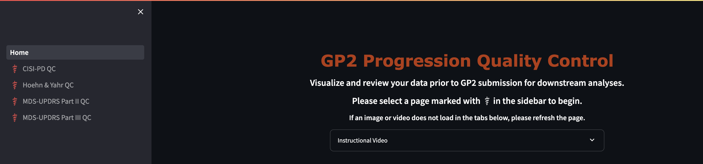

# Clinical Data Templates

**LAST UPDATED:** December 2025

---

## Overview

Welcome to the **GP2 Project Data Submission Repository** for active projects within GP2. This repository provides standardized data entry templates for collaborators contributing study data to GP2 projects through the [QC App](https://gp2-clinical-qc-dot-gp2-data-explorer.uc.r.appspot.com/).

> **Note:** This app is currently under development and more modalities will be added soon!

Using this standardized format ensures all submitted data can be efficiently integrated and analyzed by the consortium's analysis team.

If you have any questions, please contact clinicaldata@gp2.org

---

## Active Projects

### 1. PD Progression
- [Hoehn & Yahr](templates/HY/)
- [Motor](templates/Motor/)
- [Dementia](templates/Dementia/)
- [Mortality](templates/Mortality/)

### 2. Environmental Interest Group
- [Environmental Data Template](templates/Environmental/)
- SNCA x Head Injury

---

## Repository Contents

| Directory | Description |
|-----------|-------------|
| `templates/` | Blank project data templates and variable definitions ready for your study data |
| `docs/` | Detailed instructions and quick start checklist |

---

## Quick Links

- **[Download Templates](templates/)** - Access all blank data templates
- **[Variable Definitions](templates/)** - Review required fields and allowed values
- **[Detailed Instructions](docs/instructions.md)** - Step-by-step guide for data submission
- **[Quick Start Checklist](docs/quick_start_checklist.md)** - Validate your submission before uploading

---

## How to Use

1. **Download** the blank template and review the variable definitions
2. **Enter** your study data according to the instructions and allowed values
3. **Validate** your file using the quick start checklist
4. **Submit** your completed `.csv` file through the QC App

---

## Data Privacy

> **Important:** Please ensure compliance with all data privacy requirements:

- Do **NOT** include any personally identifiable information (PII)
- Ensure compliance with ethics approvals and data sharing agreements

---
